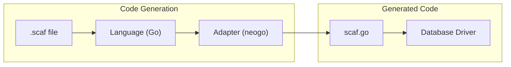

import { Aside, Tabs, TabItem } from '@astrojs/starlight/components';

# Adapters

Adapters bridge the gap between scaf's code generation and specific database drivers. Each adapter knows how to generate code that executes queries using a particular database library.

## Architecture



The flow:
1. **Language** (e.g., Go) handles the overall code structure
2. **Adapter** (e.g., neogo) generates database-specific function bodies
3. **Generated code** uses the database driver directly—no scaf runtime dependency

## Supported Adapters

| Adapter | Database | Driver | Language | Status |
|---------|----------|--------|----------|--------|
| `neogo` | Neo4j | [neogo](https://github.com/rlch/neogo) | Go | ✅ Available |
| `pgx` | PostgreSQL | [pgx](https://github.com/jackc/pgx) | Go | 🚧 Planned |
| `mysql` | MySQL | [go-sql-driver](https://github.com/go-sql-driver/mysql) | Go | 🚧 Planned |
| `sqlite` | SQLite | [modernc.org/sqlite](https://pkg.go.dev/modernc.org/sqlite) | Go | 🚧 Planned |

## neogo Adapter

The `neogo` adapter generates Go code that uses the [neogo](https://github.com/rlch/neogo) driver for Neo4j.

### Configuration

```yaml
neo4j:
  uri: bolt://localhost:7687
  username: neo4j
  password: password

generate:
  lang: go
  adapter: neogo  # Inferred from neo4j + go if not specified
  out: ./queries
  package: queries
```

### Generated Code Pattern

Given this scaf query:

```scaf
fn GetUser() `
MATCH (u:User {id: $userId})
RETURN u.name AS name, u.email AS email
`
```

The neogo adapter generates:

```go
func GetUser(ctx context.Context, db neogo.Driver, userId string) (name string, email string, err error) {
    err = db.Exec().
        Cypher(`MATCH (u:User {id: $userId}) RETURN u.name AS name, u.email AS email`).
        RunWithParams(ctx, map[string]any{"userId": userId}, "name", &name, "email", &email)
    if err != nil {
        return "", "", err
    }
    return name, email, nil
}
```

### Features

- **Standalone functions** — No receiver type, functions are package-level
- **Context-aware** — First parameter is always `context.Context`
- **Driver injection** — Second parameter is `neogo.Driver` for flexibility
- **Error handling** — All functions return `error` as the last value
- **Parameter mapping** — Query `$params` become function parameters
- **Return binding** — Query `RETURN` fields become return values

### Usage

```go
package main

import (
    "context"
    "log"
    
    "github.com/rlch/neogo"
    "myproject/queries"
)

func main() {
    ctx := context.Background()
    
    db, err := neogo.New(ctx, "bolt://localhost:7687",
        neogo.WithAuth("neo4j", "password"))
    if err != nil {
        log.Fatal(err)
    }
    defer db.Close(ctx)
    
    name, email, err := queries.GetUser(ctx, db, "user-123")
    if err != nil {
        log.Fatal(err)
    }
    
    log.Printf("User: %s <%s>", name, email)
}
```

## pgx Adapter (Planned)

<Aside type="note">
  The pgx adapter is planned for a future release.
</Aside>

The `pgx` adapter will generate Go code using [pgx](https://github.com/jackc/pgx) for PostgreSQL.

### Planned Generated Code

```go
func GetUser(ctx context.Context, pool *pgxpool.Pool, userId int) (name string, email string, err error) {
    row := pool.QueryRow(ctx,
        `SELECT name, email FROM users WHERE id = $1`,
        userId)
    err = row.Scan(&name, &email)
    if err != nil {
        return "", "", err
    }
    return name, email, nil
}
```

## Adapter Selection

### Automatic Inference

If `adapter` is not specified in config, scaf infers it from the database and language:

| Database | Language | Default Adapter |
|----------|----------|-----------------|
| `neo4j` | `go` | `neogo` |
| `postgres` | `go` | `pgx` |
| `mysql` | `go` | `mysql` |
| `sqlite` | `go` | `sqlite` |

### Manual Override

```yaml
generate:
  adapter: neogo  # Explicitly set adapter
```

Or via CLI:

```bash
scaf generate --adapter=neogo
```

## Creating Custom Adapters

<Aside type="note">
  Custom adapter support is for advanced users extending scaf.
</Aside>

Adapters implement the `golang.Binding` interface:

```go
type Binding interface {
    // Name returns the adapter identifier
    Name() string
    
    // Imports returns required import paths
    Imports() []string
    
    // ReceiverType returns method receiver type (empty for functions)
    ReceiverType() string
    
    // PrependParams returns params added before query params
    PrependParams() []BindingParam
    
    // ReturnsError returns true if functions return error
    ReturnsError() bool
    
    // GenerateBody generates the function body
    GenerateBody(ctx *BodyContext) (string, error)
}
```

Register your adapter:

```go
package myadapter

import "github.com/rlch/scaf/language/go"

func init() {
    golang.RegisterBinding(&MyBinding{})
}
```

Import in your generate command:

```go
import _ "myproject/adapters/myadapter"
```
