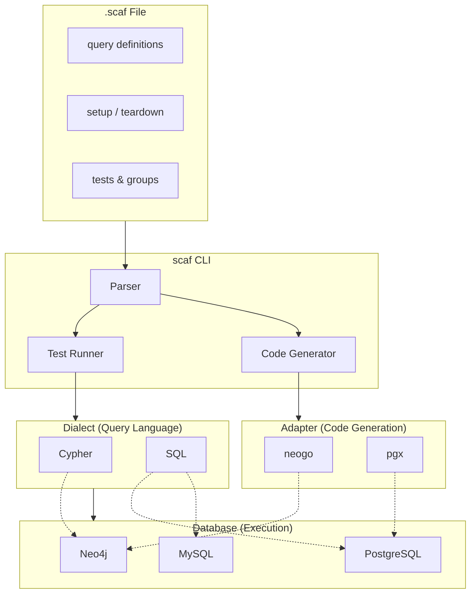

import { Aside, Card, CardGrid } from '@astrojs/starlight/components';

# Introduction to scaf

**scaf** is a declarative domain-specific language (DSL) for database test scaffolding. It provides a human-readable syntax for defining database queries and their test cases, with support for hierarchical test organization, setup blocks, input/output specifications, and post-execution assertions.

<Aside type="caution" title="Early Development">
  scaf is in active development. The DSL is stable for basic use cases, but expect additions and refinements.
</Aside>

## Why scaf?

Testing database queries typically involves:
- Writing verbose test code with lots of setup boilerplate
- Mixing test logic with database driver specifics
- Duplicating setup code across related tests
- Struggling to read and maintain complex test suites

scaf solves these problems by providing:

- **Declarative test definitions** — Specify what you expect, not how to check it
- **Hierarchical organization** — Group related tests, inherit setup from parents
- **Clear input/output syntax** — `$param: value` for inputs, `field: expected` for outputs
- **Expression-based assertions** — Complex validations using expr-lang syntax
- **Transaction isolation** — Each test runs in a transaction that rolls back

## Architecture



scaf separates several concerns:

- **Dialect** — Analyzes query syntax (Cypher, SQL) without connecting to a database
- **Database** — Handles connections and executes queries (Neo4j, PostgreSQL, MySQL)
- **Adapter** — Generates type-safe code for a specific database driver (neogo, pgx)

This means multiple databases can share a dialect (PostgreSQL, MySQL, and SQLite all use SQL), and code generation uses adapters matched to each database.

## Core Concepts

### Queries

Define named database queries that your tests will exercise:

```scaf
fn GetUser `
MATCH (u:User {id: $userId})
RETURN u.name, u.email, u.age
`

fn CreatePost `
CREATE (p:Post {title: $title, authorId: $authorId})
RETURN p
`
```

Queries use backticks to contain the raw database query in your dialect (Cypher, SQL, etc.).

### Test Scopes

Group tests by the query they're testing:

```scaf
GetUser {
  test "finds user by id" {
    $userId: 1
    
    u.name: "Alice"
  }
}
```

The scope name must match a defined query. All tests within inherit the query context.

### Tests

Each test specifies:
- **Inputs** — Parameters prefixed with `$`
- **Expected outputs** — Field paths and their expected values
- **Assertions** (optional) — Expression-based validations

```scaf
test "user is a verified adult" {
  $userId: 1
  
  u.name: "Alice"
  u.verified: true
  
  assert (u.age >= 18)
}
```

### Groups

Organize related tests and share setup:

```scaf
GetUser {
  group "existing users" {
    setup `CREATE (:User {id: 1, name: "Alice"})`
    
    test "finds Alice" {
      $userId: 1
      u.name: "Alice"
    }
    
    test "finds Bob" {
      $userId: 2
      u.name: "Bob"
    }
  }
  
  group "edge cases" {
    test "returns null for missing user" {
      $userId: 999
      u.name: null
    }
  }
}
```

### Setup & Teardown

Setup blocks run before tests, teardown runs after. They can be defined at multiple levels:

- **Suite level** — Runs once for the entire file
- **Scope level** — Runs for each query scope
- **Group level** — Runs for each group
- **Test level** — Runs for that specific test

```scaf
// Suite-level setup
setup `
CREATE (alice:User {id: 1, name: "Alice"})
`

GetUser {
  // Scope-level setup
  setup `CREATE (:Post {authorId: 1})`
  
  group "with posts" {
    // Group-level setup
    setup `CREATE (:Comment {postId: 1})`
    
    test "user with activity" {
      // Test-level setup
      setup `CREATE (:Like {userId: 1})`
      
      $userId: 1
      // ...
    }
  }
}
```

Tests inherit all setup from their ancestors, executed in order: Suite → Scope → Group → Test.

### Assertions

Beyond simple output matching, use `assert` blocks for complex validations:

```scaf
test "user data validation" {
  $userId: 1
  
  u.name: "Alice"
  
  // Expression assertions
  assert {
    (u.age >= 18)
    (u.email contains "@")
    (len(u.name) > 0)
  }
  
  // Query assertions - run another query and check results
  assert `MATCH (p:Post {authorId: 1}) RETURN count(p) as cnt` {
    (cnt > 0)
  }
}
```

## File Structure

A typical scaf file has this structure:

```scaf
// 1. Imports (optional)
import fixtures "./shared/fixtures"

// 2. Query definitions
fn GetUser `...`
fn CreatePost `...`

// 3. Global setup & teardown
setup `...`
teardown `...`

// 4. Query scopes with tests
GetUser {
  group "scenario" {
    test "case" { ... }
  }
}

CreatePost {
  test "creates post" { ... }
}
```

## What's Next

<CardGrid>
  <Card title="Installation" icon="rocket">
    Get scaf installed and configured.
    
    [Install scaf →](/getting-started/installation/)
  </Card>
  <Card title="Quick Start" icon="pencil">
    Write your first test file.
    
    [Get started →](/getting-started/quick-start/)
  </Card>
</CardGrid>
